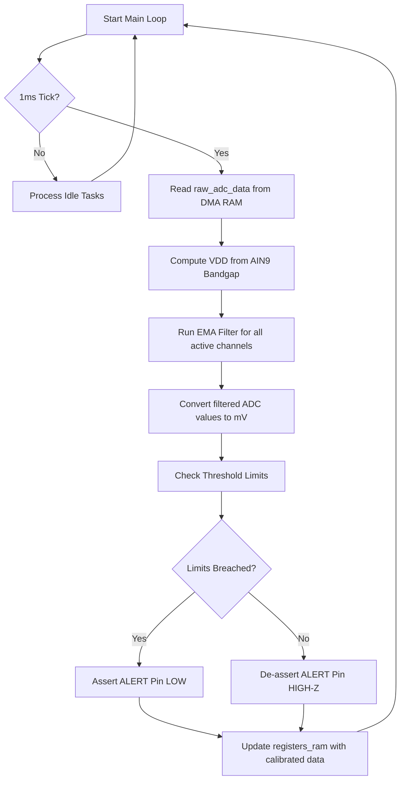

# Firmware and Hardware Architecture Design (ADD)
## CH32V003 I2C ADC Module

This document details the internal firmware structure, peripheral configurations, DMA strategies, and interrupt handling logic using the **ch32fun** framework.

---

## 1. System Block Diagram & Flow

The CH32V003 operates as a background sampling machine. The CPU remains available to process DSP filtering and serve I2C events without blocking.

```
+-------------------------------------------------------+
| CH32V003 Silicon                                      |
|                                                       |
|   +-------------+       DMA1      +---------------+   |
|   | ADC1        | ===(Ch 1)===>   | SRAM Buffer   |   |
|   | (Scan Mode) |                 | (adc_raw[9])  |   |
|   +-------------+                 +---------------+   |
|          ^                                |           |
|          | Continuous                     |           |
|          v                                v           |
|   +-------------+                 +---------------+   |
|   | Analog Pins |                 | Main Loop DSP |   |
|   | (AIN0-AIN7) |                 | (Filtering)   |   |
|   +-------------+                 +---------------+   |
|                                           |           |
|                                           v           |
|   +-------------+ Interrupt       +---------------+   |
|   | I2C1 Engine |<================| Reg Register  |   |
|   | (Slave ISR) |                 | (regs_ram[64])|   |
|   +-------------+                 +---------------+   |
|          ^                                ^           |
|          | I2C Bus                        | Save/Load |
|          v                                v           |
|     [Master MCU]                  [Flash (Last Page)] |
|                                   [   0x08003FC0    ] |
+-------------------------------------------------------+
```

---

## 2. Clocking and Core Setup

* **System Clock:** 24 MHz, derived from the internal High-Speed RC oscillator (HSI). No external crystal oscillator is required.
* **Systick Timer:** Runs at 1 kHz (1ms interval) to generate a stable timebase for the digital filter execution window.

---

## 3. Peripheral Architecture

### 3.1 ADC Configuration
* **ADC Mode:** Scan Mode (continuously steps through channels `AIN0` to `AIN7` plus internal `AIN9` reference based on the `CONFIG` register mask).
  > [!NOTE]
  > The internal 1.2V bandgap reference (scanned as the 9th channel, `raw_adc_data[8]`) is used internally by the firmware to calculate the compensated supply voltage ($V_{DD}$). Its raw value is not exposed directly in the I2C register map.
* **Sampling Time:** Configured for `55.5 cycles` on all channels to ensure stable reading of high-impedance sensors.
* **Trigger:** Continuous Conversion Mode enabled (`CONT = 1` in `ADC_CTLR2`).
* **Calibration:** Runs once during `main()` setup:
  1. Set `ADON` to wake up ADC.
  2. Pulse `RSTCAL` and poll until cleared.
  3. Pulse `CAL` and poll until cleared.

### 3.2 DMA1 Channel 1 Configuration
DMA1 Channel 1 is bound to the ADC1 Peripheral Request. It performs hardware memory writes into the RAM raw buffer.

* **Direction:** Peripheral-to-Memory.
* **Source Address:** `&ADC1->RDATAR` (Address: `0x40012440`).
* **Destination Address:** Pointer to `uint16_t raw_adc_data[9]`.
* **Buffer Size:** Variable based on scanned channels, max 9 (8 external + 1 reference).
* **Transfer Mode:** Circular Mode (`CIRC = 1`). Memory pointer increments automatically; peripheral pointer is fixed.
* **Data Width:** 16-bit for both source and destination.

### 3.3 I2C1 Slave Configuration
* **Pins:** PC1 (SDA), PC2 (SCL).
* **GPIO Speed & Configuration:** `GPIO_Speed_50MHz`, Output Alternate Function Open-Drain (`GPIO_CNF_OUT_OD_AF`).
* **I2C Interrupts:** EV (Event) interrupt enabled in standard nesting controller (NVIC).
* **Slave Address:** Dynamically loaded from SRAM register array (initialized from flash default `0x24`).

#### 3.3.1 I2C Slave ISR State Machine (`I2C1_EV_IRQHandler`)
The ISR monitors hardware flags in the `STAR1` and `STAR2` registers to handle I2C events:
* **ADDR Match (Address matched by Master):** Clear flag. Set byte index counter to the starting register offset.
* **RXNE (Byte received from Master):**
  * If this is the first byte after an ADDR match, cache it as the `Register Pointer` offset.
  * Subsequent bytes are written directly to `regs_ram[Register Pointer++]` (handling auto-increment).
* **TXE (Transmit buffer empty - Master requesting read data):**
  * Copy data from `regs_ram[Register Pointer++]` to `I2C1->DATAR`.
  * Increment the address offset.

---

## 4. Main Loop & Digital Signal Processing (DSP)

The main loop runs a non-blocking execution cycle:



### 4.1 Exponential Moving Average (EMA) Calculation
For each enabled channel $i$:
```c
// Alpha is CONFIG[7:4]
// Note: uint32_t is used for filtered and raw to guarantee intermediate
// products (up to 15 * 1023) and sums do not overflow 16-bit boundaries.
uint32_t filtered = filtered_adc[i];
uint32_t raw = raw_adc_data[i];
filtered = ((alpha * raw) + ((16 - alpha) * filtered)) >> 4;
filtered_adc[i] = filtered;
```

---

## 5. Non-Volatile Memory (NVM) Storage

The CH32V003 does not contain internal EEPROM. Non-volatile settings are stored in the final page of Program Flash.

* **Flash Page Address:** `0x08003FC0` (the last 64-byte page of the 16KB flash array).
* **Memory Map Struct:**
```c
struct NVMConfig {
    uint16_t magic_header;   // 0x55AA (to verify valid data exists)
    uint8_t  device_address; // 7-bit I2C address
    uint8_t  config_register;// Saved FILTER/CH_MASK configuration
    uint16_t alarm_limits[16];// High/Low limits for 8 channels
};
```
* **Write Routine:** When write command `0xAA` is received at `SAVE_SETTINGS` register (`0xFE`):
  1. Unlock flash peripheral using `FLASH_KEY1` and `FLASH_KEY2`.
  2. **Dirty-Flag Check:** Read the current settings in flash and compare them with the new configuration. Only perform steps 3 and 4 if the settings have changed, to avoid unnecessary flash wear.
  3. Perform page erase at address `0x08003FC0`.
  4. Perform page programming using 64-byte fast programming.
  5. Re-lock flash to prevent corruption.

> [!WARNING]
> **Flash Write Endurance:** The CH32V003 program flash has an endurance limit of approximately 10,000 erase/program cycles. To prevent wearing out the flash, the Master MCU should only write to `SAVE_SETTINGS` during user re-configuration, not as a standard part of every boot cycle or run loop.

---

## 6. Interrupt & Alert Output Circuit
* **ALERT Pin:** Configured as `PD2` Open-Drain output.
* **Rationale:** An open-drain configuration allows multiple ADC modules to tie their ALERT pins together into a single master interrupt line (Wired-AND configuration).
* **Pin States:**
  * **Alert Active:** GPIO pulled LOW.
  * **Alert Clear:** GPIO set to Input (High-Impedance), allowing the external pull-up resistor to pull the line to $V_{DD}$.
