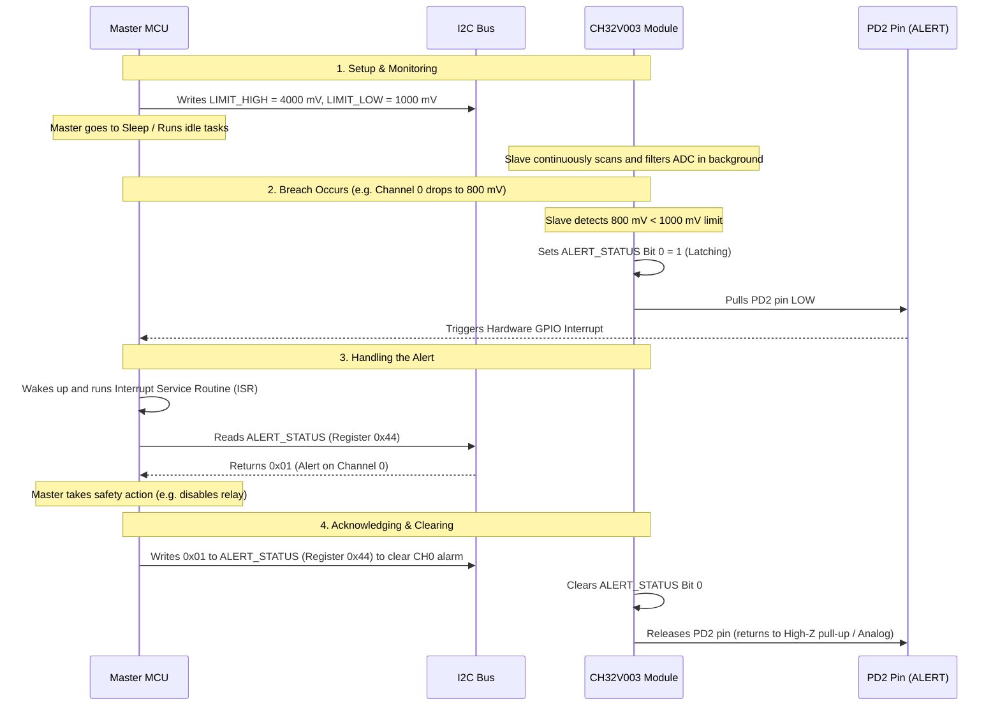

# Window Limit Monitoring & Latching Alerts Guide

This guide explains the concept, hardware implementation, and real-world utility of the **Window Limit Monitoring** and **Latching Alerts** features built into the CH32V003 I2C ADC Module.

---

## 1. Core Concepts

### Window Limit Monitoring
In a standard microcontroller setup, if you need to monitor analog voltages (such as checking if a temperature sensor is overheating or a battery cell is over-discharged), the Master MCU must continuously poll the ADC registers over the I2C bus. This continuous polling wastes I2C bus bandwidth, consumes CPU cycles, and prevents the Master MCU from entering low-power sleep modes.

**Window Limit Monitoring** offloads this comparison task entirely to the CH32V003 co-processor:
* You define a "safe operating window" for each channel by configuring `LIMIT_HIGH` and `LIMIT_LOW` registers ($mV$).
* The CH32V003 continuously scans, filters, and evaluates these readings in the background.
* The CPU on the Master MCU does not need to poll; it will be notified automatically if a limit is breached.

```
       Voltage (mV)
          ^
          |      Overvoltage Threshold
LIMIT_HIGH|=========================================== (Violated! Trigger Alert)
          |              /\
          |             /  \      Normal State
          |   /\  /\   /    \    /\
          |  /  \/  \ /      \  /  \
          | /        v        \/    \
LIMIT_LOW |=========================== \ ============= (Violated! Trigger Alert)
          |                             \   /
          |                              \_/   Undervoltage Threshold
          +---------------------------------------------> Time
```

### Latching (Sticky) Alerts
Consider a fast, transient voltage spike lasting only **2 milliseconds** (e.g., an electrostatic discharge, a fast noise spike, or a motor startup surge) that immediately returns to a normal voltage.

* **If the alert was non-latching:** The hardware interrupt pin would pull low for only 2ms and then immediately go back to high-impedance. If the Master MCU was busy performing another task (such as saving data to flash, transmitting a radio packet, or updating an LCD) during that brief 2ms window, it would completely miss the critical event.
* **With latching (sticky) alerts:** The moment a threshold is crossed, the alarm state is locked in. The corresponding channel bit in the `ALERT_STATUS` register is set to `1` and the physical `PD2` interrupt pin is held **LOW** indefinitely, *even if the voltage immediately goes back to normal*.

> [!NOTE]
> The alert remains active until the Master MCU explicitly acknowledges it by writing a `1` to the matching channel bit in the `ALERT_STATUS` register (e.g., writing `0x02` to clear the `CH1` alarm flag). This acts as a reliable hardware circuit breaker.

---

## 2. Hardware Interrupt Architecture (`PD2`)

Instead of requiring continuous I2C traffic, the CH32V003 module uses the physical `PD2` pin to signal the Master MCU when an alarm is active.

### Why Open-Drain?
The `PD2` pin is configured as an **Open-Drain** output. 
* **Alarm Inactive:** The pin is set to a High-Impedance (High-Z) state. An external pull-up resistor pulls the physical line to $V_{DD}$ (Logic `1`).
* **Alarm Active:** The CH32V003 drives the pin to Ground, pulling the line LOW (Logic `0`).

This Open-Drain configuration allows a **Wired-AND** connection. You can tie the ALERT pins of multiple modules together to a single interrupt pin on your Master MCU. If any single co-processor detects a fault, it pulls the shared line low, triggering the Master MCU's hardware interrupt.

```
              VDD
               |
             [4.7k] Pull-up Resistor
               |
Master <-------+----------------+----------------+
Interrupt Pin  |                |                |
             [PD2]            [PD2]            [PD2]
          CH32V003 #1      CH32V003 #2      CH32V003 #3
```

---

## 3. Real-World Use Cases

### Case A: Battery Management Systems (BMS) Watchdog
* **Scenario:** Monitoring individual lithium-ion cell voltages in a battery pack to protect cells from damage or fire.
* **Configuration:** 
  * `LIMIT_HIGH_CH0` = `4200` ($4.2\text{V}$ over-charge threshold)
  * `LIMIT_LOW_CH0`  = `3000` ($3.0\text{V}$ over-discharge damage threshold)
* **Application:** The Master MCU sets the limits and enters a low-power deep sleep mode. If any cell voltage drops below $3.0\text{V}$ under heavy load or spikes above $4.2\text{V}$ during charging, the co-processor pulls the `PD2` pin low. This wakes up the Master MCU, which instantly opens a series safety relay to isolate the battery pack.

### Case B: Robotic Actuator Stalling (Overcurrent Protection)
* **Scenario:** A motor on a robotic arm gets physically jammed, drawing a dangerous amount of current that could burn out the driver circuits.
* **Configuration:** An analog current sensor outputs a voltage proportional to current ($1\text{A} = 1000\text{mV}$).
  * `LIMIT_HIGH_CH1` = `2500` ($2.5\text{A}$ stall threshold)
* **Application:** During normal operations, current swings between $0.5\text{A}$ and $1.5\text{A}$. If a mechanical jam occurs, the current spikes to $3\text{A}$. The moment the filtered ADC reading crosses $2.5\text{A}$, the co-processor pulls the shared `PD2` line low. The Master MCU receives this hardware interrupt and shuts off its PWM drive signals in microseconds, preventing motor burnout.

### Case C: Power Rail Watchdog (Brownout Protection)
* **Scenario:** Monitoring input power rails ($12\text{V}$, $5\text{V}$, $3.3\text{V}$) on an industrial controller.
* **Configuration:** Voltage dividers scale the rails to fit the ADC range.
  * `LIMIT_LOW_CH2` = A value corresponding to a 10% drop on the $5\text{V}$ rail ($4.5\text{V}$).
* **Application:** If the primary $5\text{V}$ supply drops, the `PD2` pin triggers a Master MCU interrupt. The Master MCU immediately runs an emergency sequence: writing critical system state variables to EEPROM and parking mechanical elements before the board loses all capacitor charge (brownout safety).

---

## 4. Master MCU Interaction Flow

Below is the standard interaction sequence between the Master MCU and the CH32V003 module when a threshold breach occurs:


